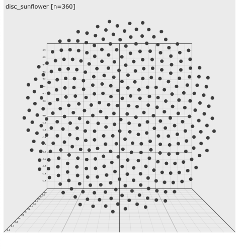

# Tech For Teachers

## Description
A collection of different applications, resources, and exercises on Mathematics. Focusing on K-12, this open-source repository will be a work in progress to adapt to the needs of our educators, students, and their parents. 

